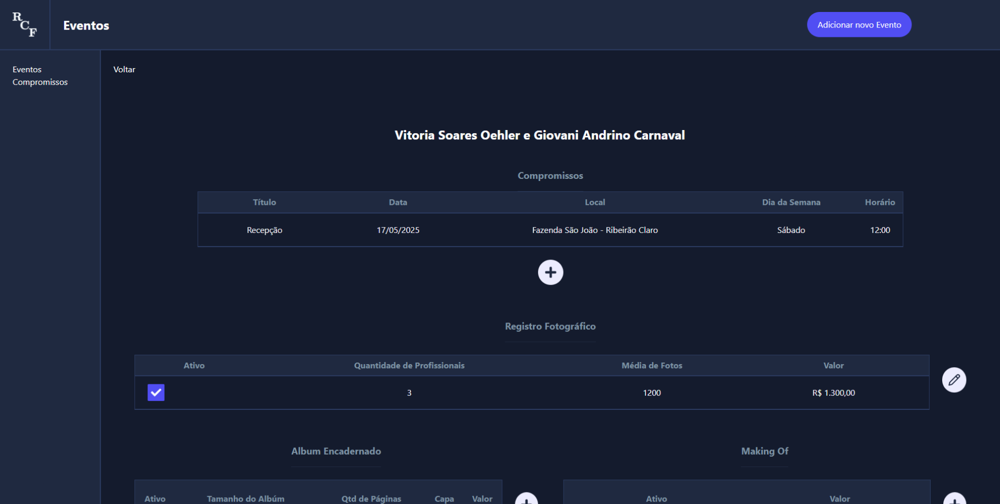
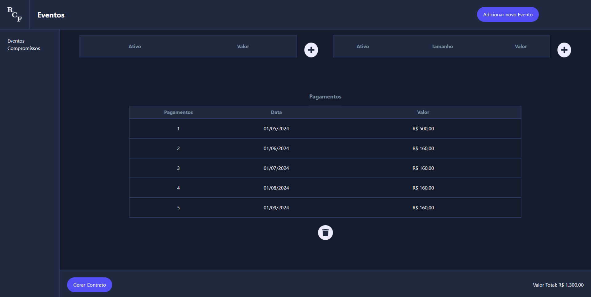
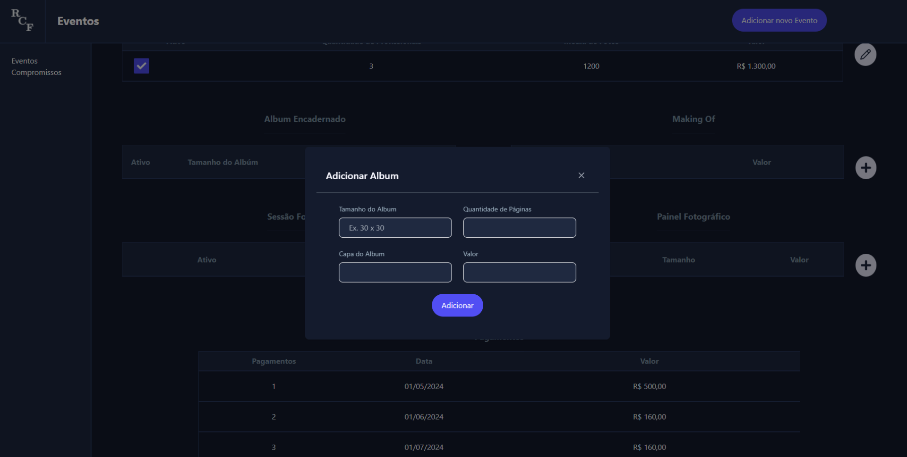

# RCF-Eventos Frontend

Este e o README para o projeto React + Typescript + Vite de gerenciamento de Eventos de um fotógrafo.

## Descrição do Projeto

Projeto desenvolvido para gerenciamento de Eventos e contratos de um fotógrafo. 

   Neste Aplicativo Web ele tem a possibilidade de cadastrar, visualizar, atualizar e apagar eventos. Trazendo a facilidade de ter controle de toda sua agenda de trabalho em um único lugar.

   Possui também uma funcionalidade de gerar o contrato, onde todas as informações cadastradas são adicionadas a um layout personalizado em formato pdf e fica disponível para ser baixado para impressão ou envio para o cliente.

### **Telas do Projeto**
<table>
  <tr>
    <td valign="top">
      Tela de Inicial
      
    </td>
    <td valign="top">
      Tela de Evento
      
   </td>
  </tr>
  <tr>
    <td valign="top">
      Tela de Evento - Pagamentos
      
    </td>
    <td valign="top">
      Tela de Evento - Cadastro de Album
      
   </td>
  </tr>
</table>

## Autor

👤 **Giovani Carnaval**

* Linkedin: [@Gi-Carnaval](https://www.linkedin.com/in/giovani-carnaval/)
* Github: [@Gi-Carnaval](https://github.com/gi-carnaval)

## Mostre seu apoio

Deixe uma ⭐️ se este projeto foi útil!

***